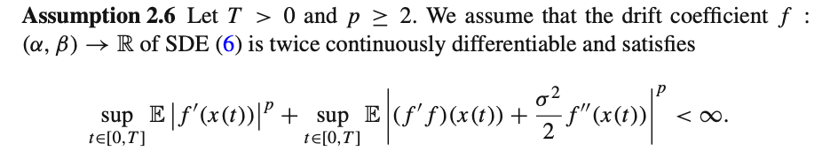
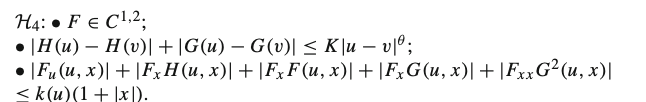
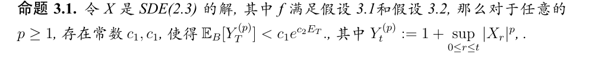
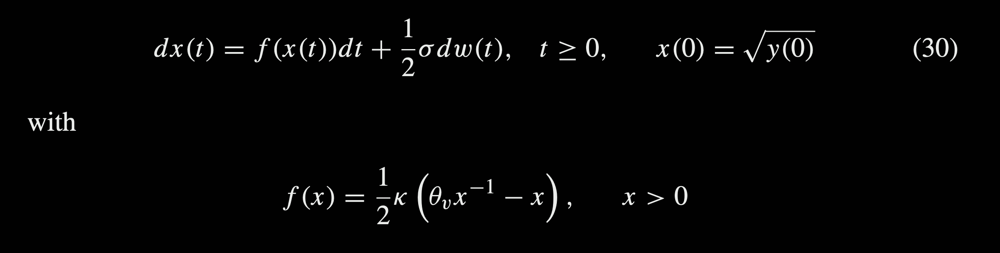
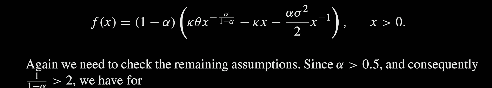
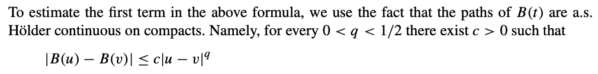
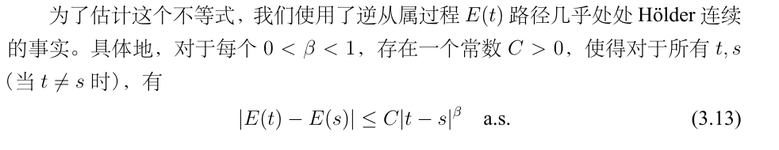
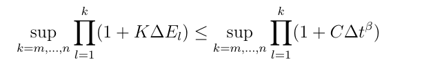

在下面这个公式中

由于dE的存在，期望无法直接放进去，因此这个假设不能使用，我们使用了下面的假设

再结合下面的命题

change1如上

question1:下面这个$p \in (0,1)$是否能成了？
理论上这个命题可以使用李雅普诺夫不等式，于是$p \in (0,1)$也能够成立的。成立就行，不影响我们的证明过程。

这样对于后面的次线性增长都能使用这个命题，后面的数值例子都可以使用了。如果不能拓展的话，就只能得到超线性增长是成立的了。但是我们后面的CIR和CEV在Lamperti变换之后貌似都是次线性增长的。

那就必须找一个超线性增长的例子了。
question2:CIR这种是属于次线性增长吗？

question3:下面这个结论是否成立？
我们参考了下面的布朗运动的一个性质

得到下面这个类似的性质(理论上是成立的)

于是在证明过程中下面这里有界性就成立了。

question4:BEM在单边Lip还是遇到了问题，我们还是得修改成单调条件

当推广到BEM的时候，发现使用离散格式会更好，但是离散格式会有一个不好的点就是最后$t - t_{n}$无法迭代。
- 离散格式的缺点：尽管我们使用$\tau_{k+1}$，一直到$\tau_N$， 但是这个$N$和使用$k\Delta t$的$N$是不一样的，在$\Delta t$中，$N = T/\Delta t$，是和$\Delta t$有关的，但是$\tau_N$中的$N$是和$\delta$无关的,$N$取决于从属$D$的离散。
- 连续格式的缺点：由于多一个$\int_{\tau_N}^s$，因此无法迭代。如果不考虑迭代的方法，而是使用类似于原论文中EM的数值方法，这个时候ito公式不知道还能不呢继续使用。
